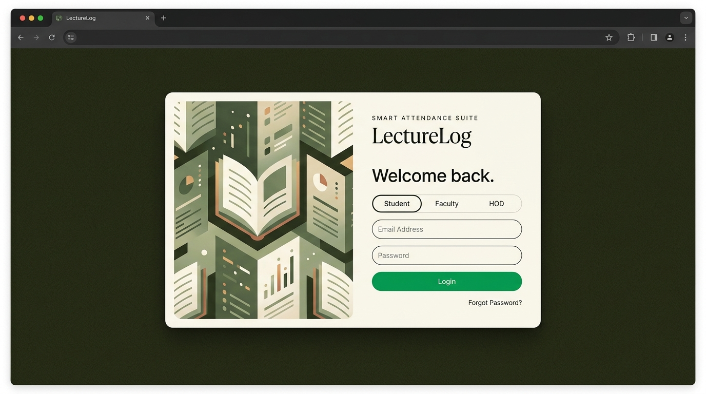
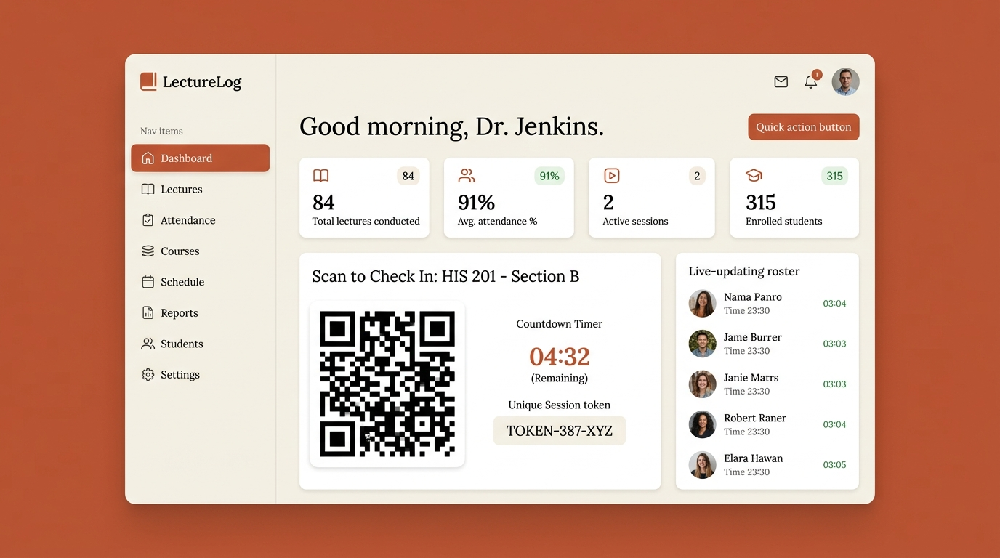
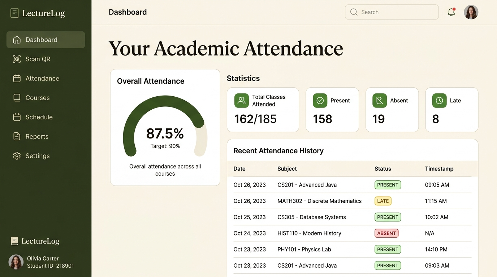
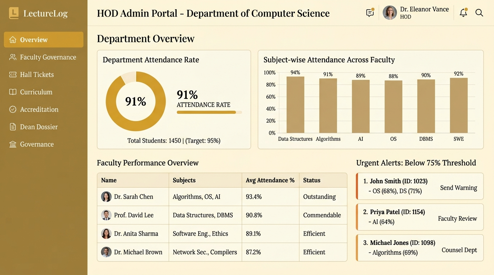

# LectureLog — Smart Attendance System

> **A full-stack academic attendance platform built with React + Node.js. Role-aware portals for Students, Faculty, and the Head of Department (HOD), with time-limited QR-based check-ins, live attendance polling, and rich analytics.**

---

## Screenshots

### Login Screen


### Faculty Portal — Dashboard & Live QR Session


### Student Portal — Attendance Overview


### HOD Portal — Department Analytics


---

## Features

### 🔐 Authentication
- JWT-based login with email and password
- Portal selector on the login screen — Student, Faculty, HOD
- Persistent browser session via `localStorage`
- Session revalidation via `/auth/me` on app startup
- Auto-logout on expired or invalid tokens
- Logout with server-side token invalidation

---

### 🎓 Student Portal — 7 Tabs

| Tab | What it does |
|---|---|
| **Dashboard** | Live attendance percentage ring, class stats (total, present, absent, late), subject breakdown |
| **Scan QR** | Camera scanner, image upload, and manual session token entry |
| **Attendance** | Full history with search, subject filter, status filter (Present/Absent/Late), and pagination |
| **Courses** | Enrolled subjects with faculty name, credit hours, and attendance progress bar |
| **Schedule** | Interactive weekly timetable (Mon–Sun) with lecture slots |
| **Reports** | Aggregated semester standing, per-subject safety margins vs 75% cutoff, CSV export, PDF print |
| **Settings** | Phone update, password change (with current password verification), telemetry toggles |

**QR Attendance Guards:**
- `404` — Invalid session token
- `400` — Expired session (5-minute window)
- `409` — Duplicate attendance prevented

---

### 🏫 Faculty Portal — 8 Tabs

| Tab | What it does |
|---|---|
| **Dashboard** | Live stats — total lectures, enrolled students, average attendance %, active sessions |
| **Lectures** | Full lecture list, create lecture (with start/end time validation), edit lecture modal |
| **Attendance** | Active QR display with 5-minute countdown, **Regenerate QR** button, live student check-in roster polling every 4 seconds |
| **Courses** | Assigned subjects with credit hours, enrolled counts, and attendance progress |
| **Schedule** | Weekly faculty timetable |
| **Reports** | Class performance summaries, deficit warnings (<75%), CSV export |
| **Students** | Enrol new students, view full roster, search & filter by course/section/name |
| **Settings** | Update department, designation, password change (bcrypt-validated current password) |

**QR Session Features:**
- Cryptographically random 64-character session tokens
- Auto-expiry after 5 minutes
- One-click regeneration issues a fresh session
- Fullscreen classroom projection view

---

### 🏛 HOD Portal — 7 Tabs

| Tab | What it does |
|---|---|
| **Overview** | Department-level attendance rate, subject-wise bar chart, faculty performance table |
| **Faculty Governance** | Faculty profiles, subject assignments, performance reviews |
| **Hall Tickets** | Issue/block exam hall tickets based on attendance standing |
| **Curriculum** | Subject and syllabus management |
| **Accreditation** | NAAC/accreditation compliance reports |
| **Dean Dossier** | Exportable department reports for dean's office |
| **Governance** | Policy configuration — attendance thresholds, consecutive absence rules, BLE/GPS verification toggles |

---

## Tech Stack

| Layer | Technology |
|---|---|
| Frontend | React 18, Vite, Axios |
| Styling | Vanilla CSS (custom design system), Material Symbols |
| Backend | Node.js, Express.js |
| Database | **SQLite** (local dev) · **PostgreSQL / Supabase** (production) |
| Auth | JWT (`jsonwebtoken`), bcrypt |
| QR Codes | `qrcode` npm package |

---

## Project Structure

```text
smart-attendance-system/
├── backend/
│   ├── database/
│   │   ├── local.sqlite          # Local dev SQLite database
│   │   ├── migrate.js            # DB migration script
│   │   ├── seed.js               # Demo data seeder
│   │   └── supabase.sql          # PostgreSQL schema for Supabase
│   ├── middleware/
│   │   ├── auth.js               # JWT verification & role guards
│   │   └── validator.js          # Request body validators
│   ├── routes/
│   │   ├── attendance.js         # Mark & retrieve attendance records
│   │   ├── auth.js               # Login, /me, logout
│   │   ├── faculty.js            # Faculty stats, profile, settings
│   │   ├── hod.js                # HOD admin endpoints
│   │   ├── lectures.js           # Create & edit lecture schedule
│   │   ├── qrSession.js          # Generate QR session tokens
│   │   ├── register.js           # New user registration
│   │   ├── student.js            # Student profile, courses, reports
│   │   └── users.js              # User & student roster management
│   ├── db.js                     # Database adapter (SQLite/PostgreSQL)
│   ├── .env.example
│   ├── package.json
│   └── server.js                 # Express app entry point
├── frontend/
│   ├── src/
│   │   ├── App.jsx               # Root app — auth, routing, role switching
│   │   ├── App.css               # Login screen styles
│   │   ├── FacultyDashboard.jsx  # Full faculty portal (8 tabs)
│   │   ├── StudentDashboard.jsx  # Full student portal (7 tabs)
│   │   ├── HodDashboard.jsx      # Full HOD portal (7 tabs)
│   │   ├── QRScanner.jsx         # Camera / image / manual QR scanner
│   │   └── index.css             # Global design system tokens
│   ├── package.json
│   └── vite.config.js
├── docs/
│   └── screenshots/              # UI screenshots for README
├── .gitignore
└── README.md
```

---

## Requirements

- **Node.js** 18 or newer
- **npm**
- A modern browser with camera permission support (for QR scanning)
- **SQLite** (bundled — works out of the box for local dev)
- **PostgreSQL / Supabase** (optional — for production deployments)

---

## Quick Start (Local Development)

### 1. Clone the repository

```bash
git clone https://github.com/mitanshsoliya/smart-attendance-system.git
cd smart-attendance-system
```

### 2. Backend setup

```bash
cd backend
npm install
```

Copy the environment example and configure it:

```bash
cp .env.example .env
```

Edit `backend/.env`:

```env
# For local development — leave DATABASE_URL blank to use SQLite automatically
DATABASE_URL=

# For production — Supabase or any PostgreSQL connection string
# DATABASE_URL=postgresql://postgres:<password>@<host>:5432/postgres

JWT_SECRET=replace-with-a-long-random-secret

PORT=5000
```

Run the database migration (creates all tables + demo data):

```bash
node database/migrate.js
node database/seed.js
```

Start the backend:

```bash
node server.js
# → Server running on http://localhost:5000
```

### 3. Frontend setup

Open a second terminal:

```bash
cd frontend
npm install
npm run dev
# → Local: http://localhost:5173
```

Open **http://localhost:5173** in your browser.

---

## Demo Credentials

The seeder creates these accounts automatically:

| Role | Email | Password | Portal |
|---|---|---|---|
| **Student** | `student@example.com` | `student123` | Student |
| **Faculty** | `faculty@example.com` | `faculty123` | Faculty |
| **HOD** | `hod@example.com` | `hod123` | HOD |

The login screen has quick auto-fill buttons for each demo account.

---

## Database Setup (Production — Supabase / PostgreSQL)

1. Create or open your [Supabase](https://supabase.com) project.
2. Go to **SQL Editor** and run [`backend/database/supabase.sql`](backend/database/supabase.sql).
3. Copy `backend/.env.example` to `backend/.env` and set `DATABASE_URL` to your Supabase connection string (**Project Settings → Database → Connection string → URI**).
4. Restart the backend — it will connect to PostgreSQL automatically.

**Schema tables:**

| Table | Key columns |
|---|---|
| `users` | `id`, `full_name`, `email`, `password` (bcrypt), `role` |
| `students` | `id`, `user_id`, `roll_number`, `section` |
| `faculty` | `id`, `user_id`, `department`, `designation` |
| `subjects` | `id`, `subject_code`, `subject_name`, `credit_hours` |
| `enrollments` | `id`, `student_id`, `subject_id` |
| `lectures` | `id`, `subject_id`, `faculty_id`, `lecture_date`, `start_time`, `end_time` |
| `qr_sessions` | `id`, `lecture_id`, `session_token`, `expires_at` |
| `attendance` | `id`, `lecture_id`, `student_id`, `status`, `attendance_time` |

---

## API Reference

All protected endpoints require:

```http
Authorization: Bearer <jwt-token>
```

### Authentication

| Method | Endpoint | Auth | Description |
|---|---|---|---|
| `POST` | `/login` | No | Authenticate and return JWT |
| `POST` | `/register` | No | Register a new user |
| `GET` | `/auth/me` | Yes | Return current user from token |
| `POST` | `/auth/logout` | Yes | Invalidate session |

### Student Endpoints

| Method | Endpoint | Role | Description |
|---|---|---|---|
| `GET` | `/student/profile` | STUDENT | View & update personal profile |
| `PUT` | `/student/profile` | STUDENT | Update phone, telemetry settings |
| `GET` | `/student/courses` | STUDENT | Enrolled courses with attendance stats |
| `GET` | `/student/schedule` | STUDENT | Weekly lecture timetable |
| `GET` | `/student/reports` | STUDENT | Semester standing, session ledger |
| `POST` | `/attendance/mark` | STUDENT | Mark attendance with session token |
| `GET` | `/attendance/my` | STUDENT | Personal attendance history |

### Faculty Endpoints

| Method | Endpoint | Role | Description |
|---|---|---|---|
| `GET` | `/faculty/stats` | FACULTY | Dashboard statistics |
| `GET` | `/faculty/profile` | FACULTY | Profile details |
| `PUT` | `/faculty/profile` | FACULTY | Update department, designation, password |
| `GET` | `/lectures/my` | FACULTY | Assigned lectures |
| `POST` | `/lectures/create` | FACULTY | Create a new lecture |
| `PUT` | `/lectures/:id` | FACULTY | Edit lecture date/time |
| `POST` | `/qr-session/create` | FACULTY | Generate QR session (5-min expiry) |
| `GET` | `/attendance/lecture/:id` | FACULTY | Live attendance for a lecture |
| `GET` | `/users/students` | FACULTY | Full student roster |
| `POST` | `/users/students` | FACULTY | Enrol a new student |

### HOD Endpoints

| Method | Endpoint | Role | Description |
|---|---|---|---|
| `GET` | `/hod/overview` | HOD | Department-level stats |
| `GET` | `/hod/faculty` | HOD | Faculty profiles & performance |
| `GET` | `/hod/students` | HOD | All students with attendance |

---

## Typical Workflow

```
Faculty                             Student
  │                                   │
  ├─ Log in → Faculty Portal          ├─ Log in → Student Portal
  │                                   │
  ├─ Create Lecture                   │
  │  (subject, date, time)            │
  │                                   │
  ├─ Generate QR Code  ←────────────  ├─ Open Scan QR tab
  │  (5-min session)    display QR    │  (camera / upload / manual)
  │                                   │
  ├─ Live roster updates  ◄────────── ├─ Scan QR → Attendance Marked (201)
  │  every 4 seconds                  │
  │                                   ├─ View Attendance History
  ├─ View Reports / CSV               ├─ View Courses & Schedule
  └─ Manage Student Roster            └─ Download Semester Report
```

---

## Development Commands

**Frontend** (`frontend/`):

```bash
npm run dev       # Start Vite dev server (http://localhost:5173)
npm run build     # Production bundle
npm run preview   # Preview production build
npm run lint      # ESLint
```

**Backend** (`backend/`):

```bash
node server.js            # Start API server (http://localhost:5000)
node database/migrate.js  # Run DB migrations
node database/seed.js     # Seed demo users & lectures
```

---

## Security Notes

- Passwords are hashed with **bcrypt** (10 salt rounds)
- JWTs are signed with `JWT_SECRET` — use a strong random string in production
- QR session tokens are cryptographically random (32 bytes, hex-encoded)
- All protected routes require a valid JWT — middleware rejects expired or tampered tokens
- Duplicate attendance is prevented at the database level
- For production: enable HTTPS, restrict CORS to your frontend origin, and add rate limiting to `/login`
- Never commit `backend/.env` — it is listed in `.gitignore`

---

## License

MIT — see [LICENSE](LICENSE) for details.
