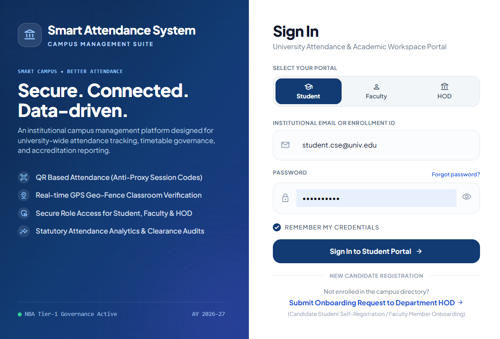
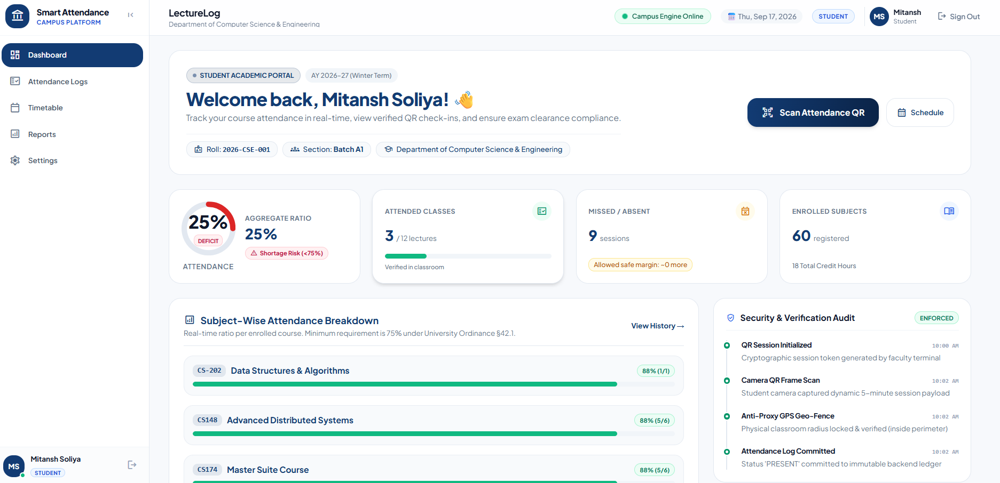
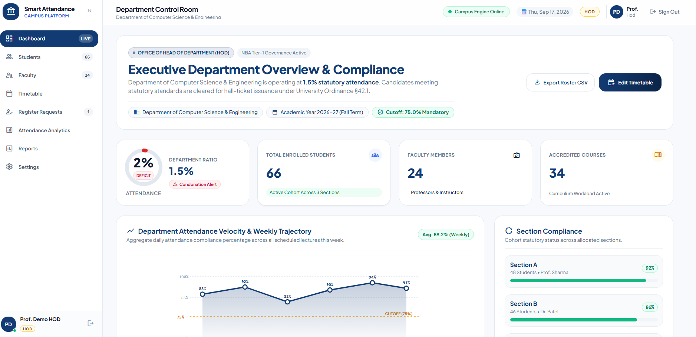

# 🎓 LectureLog — Smart Attendance & Academic Governance System

> **An enterprise-grade, mobile-responsive campus management platform built with React 19, Vite, Node.js, Express 5, Socket.io, and PostgreSQL (Supabase). Features role-aware portals for Students, Faculty, and Heads of Department (HOD) with real-time WebSocket live sync, Geo-Fenced QR check-ins, single-device anti-proxy hardware binding, departmental timetable matrices, and statutory accreditation analytics.**

[](https://smart-attendance-system-psi-lime.vercel.app/)
[](https://socket.io/)
[](https://supabase.com)
[](https://react.dev/)
[](https://expressjs.com/)
[](https://github.com/mitanshsoliya/smart-attendance-system)
[](https://smart-attendance-system-psi-lime.vercel.app/)

🌐 **Live URL**: [https://smart-attendance-system-psi-lime.vercel.app/](https://smart-attendance-system-psi-lime.vercel.app/)

---

## 🔑 Demo Test Accounts

You can test all 3 portals immediately using the pre-seeded credentials below:

| Role | Email | Password | Access / Department |
|---|---|---|---|
| **🎓 Student** | `student@example.com` | `student123` | CSE Department, Section A (Roll: `2024-CSE-001`) |
| **🏫 Faculty** | `faculty@example.com` | `faculty123` | Department of Computer Science & Engineering |
| **🏛️ HOD (CSE)** | `hod@example.com` *(or `hod.cse@univ.edu`)* | `hod123` | Head, Department of Computer Science & Engineering |
| **🏛️ HOD (IT)** | `hod.it@univ.edu` | `hod123` | Head, Department of Information Technology |
| **🏛️ HOD (ECE)** | `hod.ece@univ.edu` | `hod123` | Head, Department of Electronics & Communication |

---

## 📱 Screenshots

### 1. Unified Institutional Login & Portal Selector
*Select between Student, Faculty, and HOD portals with remember-me support, credential validation, and candidate onboarding request trigger.*


### 2. Student Portal — Attendance Gauge, Live Scanner & Weekly Timetable
*Visual circular attendance progress ring, statutory 75% cutoff indicator, live QR camera scanner, real-time push alerts when lectures start, and cohort-specific schedule.*


### 3. Faculty Portal — Live Geo-Fenced QR Broadcast & Instant Socket Roster
*Dynamic 64-character QR session generator, selectable GPS geo-fence perimeter, zero-polling real-time live roster with green ticks, audio chime, and manual attendance override.*


### 4. HOD Portal — Department Analytics, Roster Governance & Timetable Matrix
*Department-wide attendance health, student roster with section allocation, registration request approvals, and exam hall ticket clearance.*


---

## ✨ Key Highlights & System Architecture

### ⚡ 1. Zero-Polling Real-Time WebSocket Engine (Socket.io)
- **Eliminated Database Polling**: Replaced legacy 2-second polling intervals (`setInterval(..., 2000)`) with an event-driven bidirectional WebSocket pipeline, reducing server and database query load by over 90%.
- **Instant Cross-Device Sync Demo**:
  1. **Faculty Starts QR**: Faculty clicks *Start Attendance* → Backend broadcasts `lecture_started` to the relevant department room.
  2. **Student Instant Alert**: Student devices receive a floating alert banner (`LiveAttendanceToast`) with tactile haptic vibration without refreshing.
  3. **Scan & Green Tick**: Student scans QR → Attendance is verified → Backend emits `student_marked` → Faculty screen instantly chimes (Web Audio API), displays a floating check-in toast (`FacultyLiveToast`), and marks the student **PRESENT** with an animated green checkmark badge!
- **Room-Based Isolation**: Client connections are isolated into targeted rooms (`lecture_${lectureId}` and `dept_${department}`) ensuring strict privacy and network efficiency.

### 🛡️ 2. Anti-Proxy Hardware Identity Binding
- **Hardware Device Fingerprinting**: Generates SHA-256 hashed device fingerprints (`device_token_hash`) stored upon student sign-in.
- **Single-Device Enforcement Per Session**: A single physical device cannot mark attendance for more than one student in the same lecture session.
- **Automated Security Lockout**:
  - If another student attempts to submit attendance from an already utilized device, the system flags a proxy attempt.
  - Client attempts to forge or manipulate student IDs, user IDs, or enrollment numbers trigger immediate account lockout (`attendance_security_locked = TRUE`).
- **HOD Administrative Remediation**: HODs have exclusive administrative privilege to review proxy violation flags and unlock affected student accounts via `POST /hod/students/:id/unlock-attendance`.

### 📍 3. Dynamic Geo-Fenced QR Attendance Engine
- **Cryptographic 64-Character Token**: Ephemeral tokens generated per lecture session with a live countdown timer.
- **Configurable Geo-Fence Perimeter**:
  - `🌐 Open Attendance (0m)`: Open attendance mode for virtual lectures or campus-wide check-in.
  - `📍 Classroom Radius (50m)`: Enforces physical presence inside the lecture hall using GPS coordinates anchored to the faculty device.
  - `📍 Campus Radius (100m)`: Extended boundary for auditoriums and large seminar halls.
- **Haversine Distance Computation**: High-precision mathematical distance calculation verifying the student's browser coordinates against the faculty device coordinates.
- **Tri-Mode QR Scanner**:
  1. Built-in live device camera scanner powered by `html5-qrcode`.
  2. Image upload option for environments without direct camera permissions.
  3. Manual 64-character token input fallback.
- **Department Verification Guard**: Students can only mark attendance for lectures scheduled for their enrolled department.

### 📅 4. Multi-Department Timetable Matrices
- **Multi-Branch Coverage**: Out-of-the-box schedules for:
  - Computer Science & Engineering (CSE)
  - Information Technology (IT)
  - Electronics & Communication (ECE)
- **Period & Batch Granularity**:
  - Full Monday–Friday schedule tracking Periods 1 to 7 with lunch break slots.
  - Supports theory lectures and concurrent laboratory batches (`B1`, `B2`, `B3`).
- **3 Synchronized Perspectives**:
  - **Student View**: Filtered by section (`Sec A`, `Sec B`, `Sec C`) with instructor names and room numbers.
  - **Faculty View**: Individual teaching workload showing weekly classroom and lab commitments.
  - **HOD Matrix**: Department-wide master schedule with room assignments and faculty allocation.

### 📊 5. Statutory Compliance & Accreditation Reporting
- **75% Attendance Cutoff Rule**: Visual warnings and alerts for students below the mandatory 75% institutional attendance threshold.
- **Exam Hall Ticket Clearance**: HODs can audit attendance standing and issue or withhold examination admit cards with one click.
- **Faculty Class Reports**: Detailed lecture logs with present/absent statistics and downloadable CSV attendance rosters.
- **HOD Department Analytics**: High-level departmental attendance health, subject-wise analytics, and low-attendance alerts.

### 📝 6. Candidate Onboarding & Self-Registration Workflow
- **Public Request Modal**: Prospective students and faculty members can submit onboarding requests directly from the login page without administrative pre-creation.
- **Structured Intake Form**: Collects full name, email, password, department, roll number/section (students), or employee ID/designation (faculty).
- **HOD Approval Pipeline**: Department HODs review pending requests in their governance portal, approving them with automated account provisioning and section assignment.

### 📱 7. 100% Mobile & Desktop Responsive Design
- **Mobile Navigation Drawer**: Smooth slide-in navigation drawer with profile card and close button.
- **Mobile Bottom Quick-Switch Bar**: Floating bottom navigation bar on smartphone viewports (`md:hidden`) for thumb-reach ergonomics.
- **Touch-Friendly Tables**: Timetable matrices and attendance rosters feature smooth horizontal touch scrolling (`touch-pan-x`) with preserved column widths.
- **iOS Safari Zoom Prevention**: Input font sizing calibrated to 16px to prevent automatic zooming on Apple mobile devices.

---

## 🏛️ Portal Features Breakdown

### 🎓 Student Portal
| Tab | Key Functionality |
|---|---|
| **Overview** | Attendance health circular gauge, attended vs. missed classes summary, subject-wise progress bars, quick scan CTA. |
| **Scan QR** | Camera QR scanner, QR image upload, and manual token entry with automatic browser geolocation capture. |
| **Attendance History** | Searchable chronological log of all lecture check-ins, subject tags, timestamps, and status badges (Present/Absent/Late). |
| **My Courses** | Enrolled subjects, faculty contact cards, credit points, and statutory 75% attendance threshold status. |
| **Timetable** | Section-specific weekly schedule (Sec A / Sec B / Sec C) highlighting active periods, lab batches, and lecture rooms. |
| **Reports** | Semester attendance summaries, subject shortage breakdown, and downloadable compliance records. |
| **Settings** | Update student profile, phone number, and password. |

### 🏫 Faculty Portal
| Tab | Key Functionality |
|---|---|
| **Overview** | Quick stats (total lectures conducted, enrolled student count, average attendance rate) and upcoming classes. |
| **Lectures** | Schedule new lectures with subject selection, date, time slot, and section targets. |
| **Live Attendance** | Broadcast dynamic QR session with Geo-Fence (0m / 50m / 100m), **instant Socket.io live roster sync**, green ticks, and manual overrides. |
| **Schedule** | Weekly faculty schedule matrix displaying assigned theory lectures and lab sessions. |
| **Students** | Searchable directory of students enrolled in faculty subjects, filterable by section. |
| **Courses** | Syllabus codes, credit structures, and enrollment rosters for assigned subjects. |
| **Reports** | Lecture-wise attendance logs, class percentage metrics, and exportable CSV attendance sheets. |
| **Settings** | Update faculty designation, phone number, email, and security credentials. |

### 🏛️ HOD (Head of Department) Portal
| Tab | Key Functionality |
|---|---|
| **Overview** | Departmental attendance pulse, total faculty & student metrics, low-attendance alert badges. |
| **Faculty Directory** | Department faculty profiles, designation, teaching workload allocation, and contact records. |
| **Student Roster** | Complete student registry, section assignments (`Sec A`, `Sec B`), and **security unlock** for proxy-locked accounts. |
| **Registration Requests** | Review pending student/faculty onboarding submissions; approve or reject with automatic profile generation. |
| **Master Timetable** | Department-wide master schedule matrix across all sections with room allocations and slot management. |
| **Departments** | Overview of campus departments (CSE, IT, ECE) and departmental configurations. |
| **Courses** | Department curriculum subjects, course codes, and assigned instructors. |
| **Analytics** | Graphical breakdown of attendance health across courses, batches, and academic months. |
| **Hall Tickets** | Issue or withhold examination eligibility based on statutory 75% attendance criteria. |
| **Accreditation Reports**| Academic compliance summaries ready for university inspection and internal audit. |
| **Settings** | Update departmental profile, contact details, and account credentials. |

---

## 🛠️ Modern Tech Stack

| Layer | Technology | Description |
|---|---|---|
| **Frontend Framework** | **React 19** (`^19.2.8`) | Modern component-driven UI with Hooks and Concurrent features |
| **Build Tool** | **Vite** (`^6.2.0`) | Lightning-fast development server and optimized production bundler |
| **Routing** | **React Router 7** (`^7.18.3`) | Declarative client-side routing and protected route guards |
| **Styling** | **Vanilla CSS + Tailwind Utilities** | Curated design system, custom CSS variables, and responsive classes |
| **Real-Time WebSockets**| **Socket.io Client** (`^4.8.3`) | Real-time event subscription for instant roster updates and lecture push alerts |
| **QR Scanner** | **`html5-qrcode`** (`^2.3.8`) | In-browser cross-platform camera QR scanning engine |
| **HTTP Client** | **Axios** (`^1.20.0`) | Interceptor-based API client with automatic JWT header attachment |
| **Backend Runtime** | **Node.js** (LTS) | Asynchronous event-driven server runtime |
| **Web Framework** | **Express 5** (`^5.2.1`) | High-performance RESTful API endpoints and middleware architecture |
| **WebSocket Server** | **Socket.io** (`^4.8.3`) | Room-based real-time event broadcasting server attached to HTTP server |
| **Database** | **PostgreSQL (Supabase)** | Cloud relational database with relational constraints and connection pooling |
| **Database Fallback** | **SQLite3** (`^6.0.1`) | Local standalone fallback database for offline development |
| **Authentication** | **JWT (`jsonwebtoken`) & `bcryptjs`** | Stateless Bearer token verification and salted password hashing |
| **QR Code Generator**| **`qrcode`** (`^1.5.4`) | High-resolution SVG/DataURL QR code matrix generation |
| **Testing** | **Custom Automated Test Suites** | End-to-end security, anti-proxy, and identity validation suites |
| **Hosting (Frontend)**| **Vercel** | Edge network with automatic SPA rewrites and asset caching |
| **Hosting (Backend)** | **Render** | Managed Node.js web service with environment isolation |

---

## 📂 Project Structure

```text
smart-attendance-system/
├── backend/
│   ├── database/
│   │   ├── migrate.js                    # Database schema migration script
│   │   ├── seed.js                       # Core demo accounts and subjects seeder
│   │   ├── seed_hods.js                  # Multi-department HOD accounts seeder
│   │   ├── seed_timetable_faculty.js     # Faculty timetable assignments seeder
│   │   ├── seed_timetable_subjects.js    # Department subjects & curricula seeder
│   │   ├── supabase.sql                  # Comprehensive Supabase PostgreSQL DDL
│   │   └── local.sqlite                  # Local offline SQLite database fallback
│   ├── middleware/
│   │   ├── auth.js                       # JWT verification & role access guards
│   │   └── validator.js                  # Request payload validation middleware
│   ├── routes/
│   │   ├── attendance.js                 # Check-in, real-time sync, Geo-Fence & anti-proxy logic
│   │   ├── auth.js                       # /login, /me, /logout endpoints
│   │   ├── faculty.js                    # Faculty dashboard stats, profile, settings
│   │   ├── hod.js                        # HOD overview, approvals, section assignment, unlock
│   │   ├── lectures.js                   # Lecture scheduling, editing & querying
│   │   ├── qrSession.js                  # Live QR token creation, countdown, expiry & push alert
│   │   ├── register.js                   # Public candidate registration request intake
│   │   ├── student.js                    # Student overview, courses, reports, history
│   │   ├── subjects.js                   # Subject listing and department mappings
│   │   ├── timetables.js                 # Dynamic departmental timetable APIs
│   │   └── users.js                      # User profile queries & administration
│   ├── utils/
│   │   ├── geo.js                        # Haversine GPS distance calculation utility
│   │   ├── response.js                   # Standardized JSON response helpers
│   │   └── socket.js                     # Socket.io initialization and room broadcast helpers
│   ├── test_security_suite.js            # Automated security & role enforcement suite
│   ├── test_identity_lock_suite.js       # Anti-spoofing identity verification test suite
│   ├── test_device_attendance_lock_suite.js # Single-device proxy enforcement test suite
│   ├── test_master_suite.js              # Full master end-to-end regression test suite
│   ├── db.js                             # Universal PostgreSQL (pg) / SQLite query executor
│   ├── package.json                      # Backend dependencies and scripts
│   └── server.js                         # Express & Socket.io server bootstrap
├── frontend/
│   ├── src/
│   │   ├── components/
│   │   │   ├── common/                   # Modal, AttendanceRing, LiveAttendanceToast, LiveCampusPulse, etc.
│   │   │   ├── faculty/                  # FacultyAttendanceTab, FacultyLiveToast, FacultyLecturesTab, etc.
│   │   │   ├── hod/                      # HodOverviewTab, HodTimetableTab, HodStudentsTab, HodReportsTab, etc.
│   │   │   ├── layout/                   # DashboardLayout (Desktop sidebar + Mobile drawer & bottom bar)
│   │   │   ├── student/                  # StudentOverviewTab, StudentAttendanceTab, StudentTimetableTab, etc.
│   │   │   └── Login.jsx                 # Responsive multi-portal login screen with registration trigger
│   │   ├── data/
│   │   │   └── departmentTimetables.js   # Pre-configured schedules for CSE, IT, and ECE branches
│   │   ├── services/
│   │   │   ├── api.js                    # Axios instance with baseURL and token interceptor
│   │   │   ├── attendanceService.js      # Attendance marking and roster API calls
│   │   │   ├── authService.js            # Login, session verification, and logout calls
│   │   │   ├── courseService.js          # Subject and course roster API calls
│   │   │   ├── facultyService.js         # Faculty schedule and workload API calls
│   │   │   ├── hodService.js             # HOD governance, approvals, and unlock API calls
│   │   │   ├── lectureService.js         # Lecture scheduling API calls
│   │   │   ├── socket.js                 # Singleton Socket.io client connector
│   │   │   ├── studentService.js         # Student attendance and report API calls
│   │   │   └── timetableService.js       # Department timetable API calls
│   │   ├── App.jsx                       # Main application state and portal routing
│   │   ├── FacultyDashboard.jsx          # Faculty portal wrapper and real-time live sync coordinator
│   │   ├── HodDashboard.jsx              # HOD portal wrapper and tab coordinator
│   │   ├── StudentDashboard.jsx          # Student portal wrapper and socket alert listener
│   │   ├── QRScanner.jsx                 # Camera QR scanner component with upload & manual entry
│   │   ├── index.css                     # Design tokens, CSS variables, and layout utilities
│   │   └── main.jsx                      # React 19 root entry point
│   ├── vercel.json                       # SPA route rewrites & asset caching for Vercel
│   ├── vite.config.js                    # Vite configuration
│   └── package.json                      # Frontend dependencies and build scripts
├── docs/
│   └── screenshots/                      # High-resolution UI showcase images
├── package.json                          # Root monorepo build script
└── README.md                             # Comprehensive project documentation
```

---

## ⚡ Real-Time Socket.io Events Reference

| Event Name | Direction | Payload | Description |
|---|---|---|---|
| `join_lecture` | Client ➔ Server | `lectureId` | Joins client to the lecture's dedicated socket room (`lecture_${id}`). |
| `leave_lecture` | Client ➔ Server | `lectureId` | Leaves client from the lecture socket room. |
| `join_department` | Client ➔ Server | `department` | Joins student to department broadcast room (`dept_${dept}`). |
| `leave_department`| Client ➔ Server | `department` | Leaves student from department broadcast room. |
| `lecture_started` | Server ➔ Client | `{ lecture_id, subject_name, subject_code, department, faculty_name }` | Broadcast to students when a live QR session begins. Triggers instant floating toast. |
| `student_marked` | Server ➔ Client | `{ id, lecture_id, student_id, full_name, roll_number, section, status, distance_meters, timestamp }` | Emitted when a student marks attendance. Updates faculty roster instantly with green checkmark. |
| `student_status_updated` | Server ➔ Client | `{ lecture_id, student_id, status, attendance_time }` | Broadcast when faculty/HOD manually overrides attendance status. |

---

## 🔌 REST API Reference

### 🔐 Authentication & Session
| Method | Endpoint | Access | Description |
|---|---|---|---|
| `POST` | `/login` | Public | Authenticates credentials, validates role, issues JWT and binds device |
| `GET` | `/auth/me` | Authenticated | Validates session token and returns active user profile |
| `POST` | `/auth/logout` | Authenticated | Terminates session and clears active device token |

### 📝 Registration Requests
| Method | Endpoint | Access | Description |
|---|---|---|---|
| `POST` | `/register/request` | Public | Submits a new student or faculty onboarding request |
| `GET` | `/hod/registration-requests` | HOD | Lists all pending onboarding requests for the department |
| `POST` | `/hod/registration-requests/:id/approve` | HOD | Approves request, generates user account, and assigns section |
| `POST` | `/hod/registration-requests/:id/reject` | HOD | Rejects request with optional administrative remarks |

### 📍 QR Session & Attendance
| Method | Endpoint | Access | Description |
|---|---|---|---|
| `POST` | `/qr/create` | Faculty / HOD | Generates dynamic 64-char QR session token with geo-fence & timer, emits `lecture_started` |
| `POST` | `/qr/stop` | Faculty / HOD | Immediately expires active QR session and auto-marks non-attending students as Absent |
| `POST` | `/attendance/mark` | Student | Marks attendance via session token, validates GPS location & device, emits `student_marked` |
| `GET` | `/attendance/lecture/:lectureId` | Faculty / HOD | Fetches lecture attendance roster (PRESENT first, ABSENT after session ends) |
| `PUT` | `/attendance/status` | Faculty / HOD | Manually override a student's attendance (PRESENT / ABSENT) with live socket sync |
| `GET` | `/attendance/my` | Student | Returns student's personal attendance history |

### 📅 Lectures & Department Timetables
| Method | Endpoint | Access | Description |
|---|---|---|---|
| `GET` | `/lectures` | Authenticated | Lists upcoming and past scheduled lectures |
| `POST` | `/lectures` | Faculty / HOD | Schedules a new lecture slot with subject, time, and room |
| `PUT` | `/lectures/:id` | Faculty / HOD | Updates scheduled lecture details |
| `DELETE` | `/lectures/:id` | Faculty / HOD | Deletes a scheduled lecture |
| `GET` | `/timetables/department/:dept` | Authenticated | Fetches weekly master timetable for a department (CSE, IT, ECE) |
| `POST` | `/timetables` | HOD | Updates master departmental timetable slot allocations |

### 🏛️ HOD Governance & Student Management
| Method | Endpoint | Access | Description |
|---|---|---|---|
| `GET` | `/hod/overview` | HOD | Returns department statistics, attendance rate, and alerts |
| `GET` | `/hod/students` | HOD | Directory of department students with section filter and lock status |
| `POST` | `/hod/students/:id/unlock-attendance` | HOD | **Unlocks proxy-locked student accounts** and clears security lock |
| `POST` | `/hod/students/:id/section` | HOD | Reassigns a student to a different cohort section |
| `GET` | `/hod/faculty` | HOD | Directory of departmental faculty and teaching loads |
| `GET` | `/hod/analytics` | HOD | Detailed subject and month-wise attendance metrics |

---

## 🚀 Quick Start (Local Development)

### 1. Prerequisites
- **Node.js**: v18.0.0 or higher
- **npm**: v9.0.0 or higher
- **PostgreSQL**: Supabase cloud instance (recommended) or local PostgreSQL

### 2. Clone the Repository
```bash
git clone https://github.com/mitanshsoliya/smart-attendance-system.git
cd smart-attendance-system
```

### 3. Backend Setup
```bash
cd backend
npm install
```

Create a `backend/.env` file:
```env
PORT=5000
DATABASE_URL=postgresql://postgres:<your_password>@<your_host>:5432/postgres
JWT_SECRET=your_super_secret_jwt_key_2026
```

Run database migrations and seed demo data:
```bash
# 1. Run schema migrations
node database/migrate.js

# 2. Seed core demo users (Student, Faculty, HOD)
node database/seed.js

# 3. Seed department curricula and subjects
node database/seed_timetable_subjects.js

# 4. Seed faculty timetable allocations
node database/seed_timetable_faculty.js

# 5. Seed multi-department HOD credentials
node database/seed_hods.js
```

Start the backend server:
```bash
node server.js
# Or start with live reload:
npm run dev
# → Server running on http://localhost:5000
```

### 4. Frontend Setup
In a new terminal window:
```bash
cd frontend
npm install
npm run dev
# → Local server running on http://localhost:5173
```

Open **http://localhost:5173** in your browser to access the application.

---

## 🧪 Automated Test Suites

The backend includes a comprehensive suite of automated verification scripts testing end-to-end security, anti-proxy mechanics, and API contracts:

```bash
cd backend

# 1. Master End-to-End Regression Suite (Health, Auth, RBAC, Sessions)
node test_master_suite.js

# 2. Single-Device Anti-Proxy Hardware Binding Suite
node test_device_attendance_lock_suite.js

# 3. Identity Manipulation & Tamper Detection Suite
node test_identity_lock_suite.js

# 4. Role Authorization & Cross-Portal Access Guard Suite
node test_security_suite.js
```

---

## ☁️ Production Deployment

### Frontend Deployment (Vercel)
1. Import the repository into your [Vercel Dashboard](https://vercel.com).
2. Set **Root Directory** to `frontend`.
3. Framework Preset: `Vite`.
4. Add Environment Variable:
   - `VITE_API_BASE_URL` = `https://your-backend-api.onrender.com`
5. Click **Deploy**. Vercel will automatically apply the route rewrites defined in `frontend/vercel.json`.

### Backend Deployment (Render)
1. Create a new **Web Service** on [Render](https://render.com) linked to your repository.
2. Set **Root Directory** to `backend`.
3. Set **Build Command** to `npm install`.
4. Set **Start Command** to `npm start`.
5. Configure Environment Variables:
   - `DATABASE_URL` (Supabase PostgreSQL connection string)
   - `JWT_SECRET` (Strong random secret string)
   - `PORT` = `5000` (or leave default assigned by Render)
6. Click **Create Web Service**.

---

## 🔒 Security Practices Summary

- **Real-Time WebSocket Authorization**: Socket connections join rooms conditionally based on verified lecture and department scopes.
- **Hardware Fingerprint Hashing**: Client device tokens are hashed using SHA-256 before persistence or comparison.
- **Single-Device Proxy Ban**: Prevents proxy attendance by restricting each physical device to one submission per lecture session.
- **Haversine GPS Verification**: High-precision physical classroom presence validation computed strictly on the backend.
- **Stateless JWT Authorization**: Signed JSON Web Tokens with embedded role claims and expiry validation on every private API route.
- **Input Sanitization & Parameter Cleansing**: Strict parameter filtering strips unauthorized student IDs or roll numbers sent in payloads.
- **Database Unique Constraints**: `UNIQUE(lecture_id, student_id)` database-level constraint prevents duplicate check-ins under concurrent requests.
- **Environment Variable Isolation**: Database connection secrets and cryptographic keys are isolated from version control via `.gitignore`.

---

## 📄 License

This project is licensed under the **MIT License** — see the [LICENSE](LICENSE) file for details.
